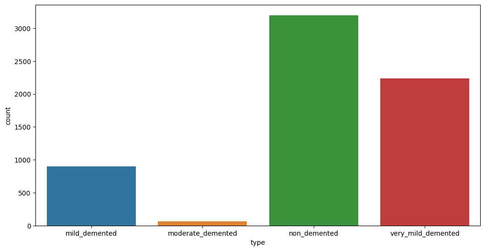
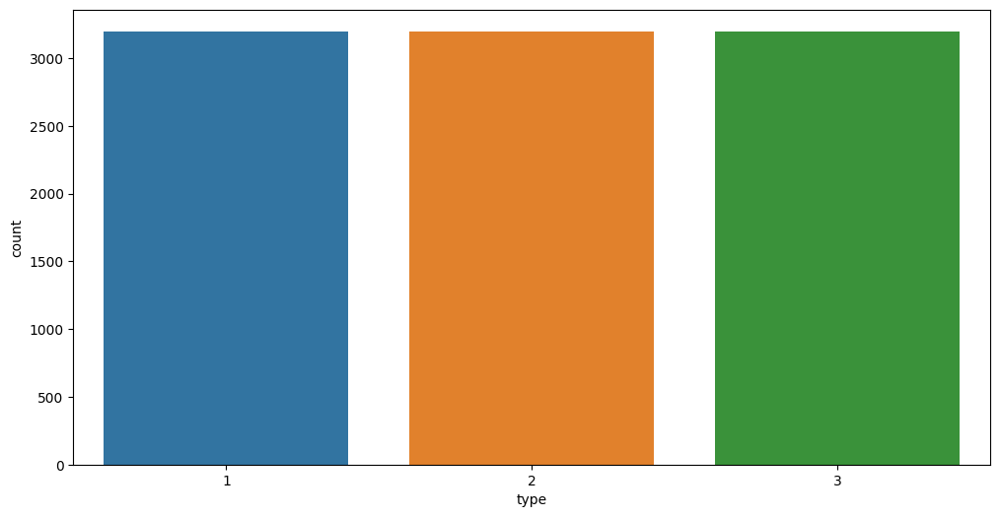
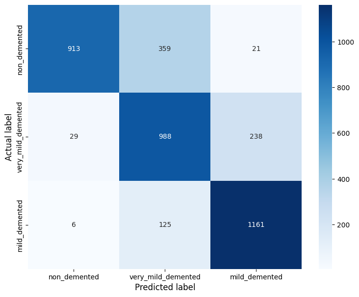
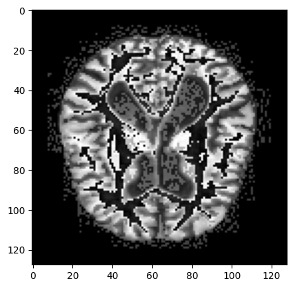
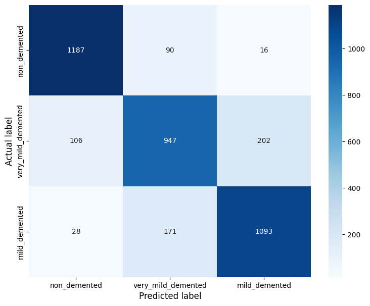

# Predicting dementia stage using MRI from Alzheimers patients using
neural networks
Flemming Wu

[Link](https://www.kaggle.com/datasets/sachinkumar413/alzheimer-mri-dataset)
to data set

## Data Preprocessing

``` python
#! kaggle datasets download -d sachinkumar413/alzheimer-mri-dataset
```

``` python
import pandas as pd
import numpy as np
import matplotlib.pyplot as plt
import seaborn as sns
from PIL import Image
import glob
import os
from imblearn.over_sampling import SMOTE
from sklearn.model_selection import train_test_split
from sklearn.metrics import confusion_matrix
```

``` python
## read all data into pandas dataframe
dfs = [] # list of dataframes
for i in os.listdir('Dataset'):
    filelist = glob.glob('./Dataset/{}/*.jpg'.format(i))
    x = np.array([np.array(Image.open(fname)).reshape(1,-1).flatten() for fname in filelist])
    x = pd.DataFrame(x)
    x['type'] = i.lower()
    dfs.append(x)
```

``` python
df = pd.concat(dfs)
```

``` python
fig, ax = plt.subplots(figsize=(12, 6))
sns.countplot(data=df, x='type', ax=ax);
```



``` python
# remove moderate demented, not enough training examples
df = df[df.type != 'moderate_demented']
```

``` python
X, y = df.iloc[:,:-1], df['type']
```

``` python
sm = SMOTE(sampling_strategy='not majority', random_state=2, k_neighbors=10)
X_res, y_res = sm.fit_resample(X, y)

y_res = y_res.map({'non_demented': 1, 'very_mild_demented': 2, 'mild_demented': 3})
```

``` python
df_orig = df.copy()

df = pd.DataFrame(X_res.copy())
df['type'] = y_res
```

``` python
fig, ax = plt.subplots(figsize=(12, 6))
sns.countplot(data=df, x='type', ax=ax);
```



``` python
## remove 0 variance pixels
#df.var(numeric_only=True)
```

## Building a Neural Network

``` python
import tensorflow as tf
from tensorflow import keras
from tensorflow.keras.models import Sequential
from tensorflow.keras.layers import Dense, Conv2D, Flatten
```

    2023-04-26 18:20:21.939796: I tensorflow/core/platform/cpu_feature_guard.cc:193] This TensorFlow binary is optimized with oneAPI Deep Neural Network Library (oneDNN) to use the following CPU instructions in performance-critical operations:  AVX2 FMA
    To enable them in other operations, rebuild TensorFlow with the appropriate compiler flags.
    2023-04-26 18:20:22.408692: E tensorflow/stream_executor/cuda/cuda_blas.cc:2981] Unable to register cuBLAS factory: Attempting to register factory for plugin cuBLAS when one has already been registered
    2023-04-26 18:20:23.635367: W tensorflow/stream_executor/platform/default/dso_loader.cc:64] Could not load dynamic library 'libnvinfer.so.7'; dlerror: libnvinfer.so.7: cannot open shared object file: No such file or directory; LD_LIBRARY_PATH: :/home/flemm0/miniconda3/envs/tf/lib/:/home/flemm0/miniconda3/envs/tf/lib/python3.9/site-packages/nvidia/cudnn/lib
    2023-04-26 18:20:23.638094: W tensorflow/stream_executor/platform/default/dso_loader.cc:64] Could not load dynamic library 'libnvinfer_plugin.so.7'; dlerror: libnvinfer_plugin.so.7: cannot open shared object file: No such file or directory; LD_LIBRARY_PATH: :/home/flemm0/miniconda3/envs/tf/lib/:/home/flemm0/miniconda3/envs/tf/lib/python3.9/site-packages/nvidia/cudnn/lib
    2023-04-26 18:20:23.638104: W tensorflow/compiler/tf2tensorrt/utils/py_utils.cc:38] TF-TRT Warning: Cannot dlopen some TensorRT libraries. If you would like to use Nvidia GPU with TensorRT, please make sure the missing libraries mentioned above are installed properly.

``` python
print(keras.__version__)
```

    2.10.0

``` python
X_train, X_test, y_train, y_test = train_test_split(X_res, y_res, test_size=0.4, random_state=2)

X_train, X_test = X_train.astype('float32') / 255, X_test.astype('float32') / 255
y_train, y_test = np.array(y_train.astype('float32')), np.array(y_test.astype('float32'))
```

``` python
nn = Sequential()
nn.add(Dense(1000, input_shape=(16384,), activation='relu'))
nn.add(Dense(1000, activation='relu'))
nn.add(Dense(250, activation='softmax'))
```

    2023-04-26 18:20:33.050155: I tensorflow/stream_executor/cuda/cuda_gpu_executor.cc:966] could not open file to read NUMA node: /sys/bus/pci/devices/0000:07:00.0/numa_node
    Your kernel may have been built without NUMA support.
    2023-04-26 18:20:33.299214: I tensorflow/stream_executor/cuda/cuda_gpu_executor.cc:966] could not open file to read NUMA node: /sys/bus/pci/devices/0000:07:00.0/numa_node
    Your kernel may have been built without NUMA support.
    2023-04-26 18:20:33.299285: I tensorflow/stream_executor/cuda/cuda_gpu_executor.cc:966] could not open file to read NUMA node: /sys/bus/pci/devices/0000:07:00.0/numa_node
    Your kernel may have been built without NUMA support.
    2023-04-26 18:20:33.300953: I tensorflow/core/platform/cpu_feature_guard.cc:193] This TensorFlow binary is optimized with oneAPI Deep Neural Network Library (oneDNN) to use the following CPU instructions in performance-critical operations:  AVX2 FMA
    To enable them in other operations, rebuild TensorFlow with the appropriate compiler flags.
    2023-04-26 18:20:33.304185: I tensorflow/stream_executor/cuda/cuda_gpu_executor.cc:966] could not open file to read NUMA node: /sys/bus/pci/devices/0000:07:00.0/numa_node
    Your kernel may have been built without NUMA support.
    2023-04-26 18:20:33.304256: I tensorflow/stream_executor/cuda/cuda_gpu_executor.cc:966] could not open file to read NUMA node: /sys/bus/pci/devices/0000:07:00.0/numa_node
    Your kernel may have been built without NUMA support.
    2023-04-26 18:20:33.304299: I tensorflow/stream_executor/cuda/cuda_gpu_executor.cc:966] could not open file to read NUMA node: /sys/bus/pci/devices/0000:07:00.0/numa_node
    Your kernel may have been built without NUMA support.
    2023-04-26 18:20:34.607164: I tensorflow/stream_executor/cuda/cuda_gpu_executor.cc:966] could not open file to read NUMA node: /sys/bus/pci/devices/0000:07:00.0/numa_node
    Your kernel may have been built without NUMA support.
    2023-04-26 18:20:34.607804: I tensorflow/stream_executor/cuda/cuda_gpu_executor.cc:966] could not open file to read NUMA node: /sys/bus/pci/devices/0000:07:00.0/numa_node
    Your kernel may have been built without NUMA support.
    2023-04-26 18:20:34.607829: I tensorflow/core/common_runtime/gpu/gpu_device.cc:1700] Could not identify NUMA node of platform GPU id 0, defaulting to 0.  Your kernel may not have been built with NUMA support.
    2023-04-26 18:20:34.607896: I tensorflow/stream_executor/cuda/cuda_gpu_executor.cc:966] could not open file to read NUMA node: /sys/bus/pci/devices/0000:07:00.0/numa_node
    Your kernel may have been built without NUMA support.
    2023-04-26 18:20:34.607937: I tensorflow/core/common_runtime/gpu/gpu_device.cc:1616] Created device /job:localhost/replica:0/task:0/device:GPU:0 with 3919 MB memory:  -> device: 0, name: NVIDIA GeForce GTX 1660 Ti, pci bus id: 0000:07:00.0, compute capability: 7.5

the code above is equivalent to passing list of dense layers into the
`Sequential()` class:

    nn = Sequential(
        [
            layers.Dense(1000, input_shape=(16384,), activation='relu'),
            layers.Dense(1000, activation='relu'),
            layers.Dense(250, activation='softmax')
        ]
    )

``` python
nn.compile(loss=tf.keras.losses.SparseCategoricalCrossentropy(), optimizer='adam', metrics=['accuracy', keras.metrics.SparseCategoricalAccuracy()])
```

``` python
nn.fit(X_train, y_train, epochs=70, batch_size=10)
```

    Epoch 1/70
    576/576 [==============================] - 7s 8ms/step - loss: 1.2576 - accuracy: 0.5208 - sparse_categorical_accuracy: 0.5208
    Epoch 2/70
    576/576 [==============================] - 4s 6ms/step - loss: 0.8128 - accuracy: 0.5811 - sparse_categorical_accuracy: 0.5811
    Epoch 3/70
    576/576 [==============================] - 3s 6ms/step - loss: 0.7810 - accuracy: 0.6092 - sparse_categorical_accuracy: 0.6092
    Epoch 4/70
    576/576 [==============================] - 3s 6ms/step - loss: 0.7660 - accuracy: 0.6085 - sparse_categorical_accuracy: 0.6085
    Epoch 5/70
    576/576 [==============================] - 3s 6ms/step - loss: 0.6945 - accuracy: 0.6519 - sparse_categorical_accuracy: 0.6519
    Epoch 6/70
    576/576 [==============================] - 3s 6ms/step - loss: 0.6393 - accuracy: 0.7016 - sparse_categorical_accuracy: 0.7016
    Epoch 7/70
    576/576 [==============================] - 3s 6ms/step - loss: 0.5815 - accuracy: 0.7333 - sparse_categorical_accuracy: 0.7333
    Epoch 8/70
    576/576 [==============================] - 3s 6ms/step - loss: 0.5750 - accuracy: 0.7417 - sparse_categorical_accuracy: 0.7417
    Epoch 9/70
    576/576 [==============================] - 3s 6ms/step - loss: 0.4875 - accuracy: 0.7806 - sparse_categorical_accuracy: 0.7806
    Epoch 10/70
    576/576 [==============================] - 3s 6ms/step - loss: 0.4841 - accuracy: 0.7802 - sparse_categorical_accuracy: 0.7802
    Epoch 11/70
    576/576 [==============================] - 3s 6ms/step - loss: 0.4522 - accuracy: 0.7964 - sparse_categorical_accuracy: 0.7964
    Epoch 12/70
    576/576 [==============================] - 3s 6ms/step - loss: 0.4155 - accuracy: 0.8141 - sparse_categorical_accuracy: 0.8141
    Epoch 13/70
    576/576 [==============================] - 3s 6ms/step - loss: 0.4134 - accuracy: 0.8177 - sparse_categorical_accuracy: 0.8177
    Epoch 14/70
    576/576 [==============================] - 3s 6ms/step - loss: 0.3958 - accuracy: 0.8293 - sparse_categorical_accuracy: 0.8293
    Epoch 15/70
    576/576 [==============================] - 3s 6ms/step - loss: 0.3398 - accuracy: 0.8486 - sparse_categorical_accuracy: 0.8486
    Epoch 16/70
    576/576 [==============================] - 3s 6ms/step - loss: 0.3269 - accuracy: 0.8613 - sparse_categorical_accuracy: 0.8613
    Epoch 17/70
    576/576 [==============================] - 3s 6ms/step - loss: 0.2927 - accuracy: 0.8762 - sparse_categorical_accuracy: 0.8762
    Epoch 18/70
    576/576 [==============================] - 3s 6ms/step - loss: 0.2941 - accuracy: 0.8800 - sparse_categorical_accuracy: 0.8800
    Epoch 19/70
    576/576 [==============================] - 4s 6ms/step - loss: 0.2515 - accuracy: 0.8964 - sparse_categorical_accuracy: 0.8964
    Epoch 20/70
    576/576 [==============================] - 3s 6ms/step - loss: 0.2583 - accuracy: 0.8951 - sparse_categorical_accuracy: 0.8951
    Epoch 21/70
    576/576 [==============================] - 3s 6ms/step - loss: 0.2851 - accuracy: 0.8865 - sparse_categorical_accuracy: 0.8865
    Epoch 22/70
    576/576 [==============================] - 3s 6ms/step - loss: 0.2569 - accuracy: 0.8958 - sparse_categorical_accuracy: 0.8958
    Epoch 23/70
    576/576 [==============================] - 3s 6ms/step - loss: 0.2333 - accuracy: 0.9078 - sparse_categorical_accuracy: 0.9078
    Epoch 24/70
    576/576 [==============================] - 3s 6ms/step - loss: 0.2334 - accuracy: 0.9062 - sparse_categorical_accuracy: 0.9062
    Epoch 25/70
    576/576 [==============================] - 3s 6ms/step - loss: 0.2022 - accuracy: 0.9170 - sparse_categorical_accuracy: 0.9170
    Epoch 26/70
    576/576 [==============================] - 3s 6ms/step - loss: 0.2147 - accuracy: 0.9113 - sparse_categorical_accuracy: 0.9113
    Epoch 27/70
    576/576 [==============================] - 3s 6ms/step - loss: 0.2535 - accuracy: 0.9007 - sparse_categorical_accuracy: 0.9007
    Epoch 28/70
    576/576 [==============================] - 4s 6ms/step - loss: 0.2085 - accuracy: 0.9128 - sparse_categorical_accuracy: 0.9128
    Epoch 29/70
    576/576 [==============================] - 3s 6ms/step - loss: 0.1925 - accuracy: 0.9252 - sparse_categorical_accuracy: 0.9252
    Epoch 30/70
    576/576 [==============================] - 3s 6ms/step - loss: 0.2086 - accuracy: 0.9191 - sparse_categorical_accuracy: 0.9191
    Epoch 31/70
    576/576 [==============================] - 3s 6ms/step - loss: 0.1662 - accuracy: 0.9325 - sparse_categorical_accuracy: 0.9325
    Epoch 32/70
    576/576 [==============================] - 3s 6ms/step - loss: 0.1703 - accuracy: 0.9335 - sparse_categorical_accuracy: 0.9335
    Epoch 33/70
    576/576 [==============================] - 3s 6ms/step - loss: 0.1756 - accuracy: 0.9359 - sparse_categorical_accuracy: 0.9359
    Epoch 34/70
    576/576 [==============================] - 3s 6ms/step - loss: 0.1302 - accuracy: 0.9465 - sparse_categorical_accuracy: 0.9465
    Epoch 35/70
    576/576 [==============================] - 3s 6ms/step - loss: 0.1893 - accuracy: 0.9247 - sparse_categorical_accuracy: 0.9247
    Epoch 36/70
    576/576 [==============================] - 3s 6ms/step - loss: 0.1318 - accuracy: 0.9493 - sparse_categorical_accuracy: 0.9493
    Epoch 37/70
    576/576 [==============================] - 3s 6ms/step - loss: 0.1365 - accuracy: 0.9514 - sparse_categorical_accuracy: 0.9514
    Epoch 38/70
    576/576 [==============================] - 3s 6ms/step - loss: 0.1782 - accuracy: 0.9373 - sparse_categorical_accuracy: 0.9373
    Epoch 39/70
    576/576 [==============================] - 3s 6ms/step - loss: 0.1475 - accuracy: 0.9498 - sparse_categorical_accuracy: 0.9498
    Epoch 40/70
    576/576 [==============================] - 3s 6ms/step - loss: 0.2341 - accuracy: 0.9271 - sparse_categorical_accuracy: 0.9271
    Epoch 41/70
    576/576 [==============================] - 3s 6ms/step - loss: 0.1665 - accuracy: 0.9377 - sparse_categorical_accuracy: 0.9377
    Epoch 42/70
    576/576 [==============================] - 3s 6ms/step - loss: 0.1273 - accuracy: 0.9536 - sparse_categorical_accuracy: 0.9536
    Epoch 43/70
    576/576 [==============================] - 3s 6ms/step - loss: 0.1841 - accuracy: 0.9359 - sparse_categorical_accuracy: 0.9359
    Epoch 44/70
    576/576 [==============================] - 3s 6ms/step - loss: 0.0947 - accuracy: 0.9681 - sparse_categorical_accuracy: 0.9681
    Epoch 45/70
    576/576 [==============================] - 3s 6ms/step - loss: 0.1266 - accuracy: 0.9583 - sparse_categorical_accuracy: 0.9583
    Epoch 46/70
    576/576 [==============================] - 3s 6ms/step - loss: 0.1055 - accuracy: 0.9656 - sparse_categorical_accuracy: 0.9656
    Epoch 47/70
    576/576 [==============================] - 3s 6ms/step - loss: 0.1369 - accuracy: 0.9523 - sparse_categorical_accuracy: 0.9523
    Epoch 48/70
    576/576 [==============================] - 3s 6ms/step - loss: 0.1014 - accuracy: 0.9627 - sparse_categorical_accuracy: 0.9627
    Epoch 49/70
    576/576 [==============================] - 3s 6ms/step - loss: 0.0996 - accuracy: 0.9655 - sparse_categorical_accuracy: 0.9655
    Epoch 50/70
    576/576 [==============================] - 3s 6ms/step - loss: 0.1227 - accuracy: 0.9568 - sparse_categorical_accuracy: 0.9568
    Epoch 51/70
    576/576 [==============================] - 3s 6ms/step - loss: 0.0853 - accuracy: 0.9710 - sparse_categorical_accuracy: 0.9710
    Epoch 52/70
    576/576 [==============================] - 3s 6ms/step - loss: 0.1458 - accuracy: 0.9514 - sparse_categorical_accuracy: 0.9514
    Epoch 53/70
    576/576 [==============================] - 3s 6ms/step - loss: 0.1041 - accuracy: 0.9639 - sparse_categorical_accuracy: 0.9639
    Epoch 54/70
    576/576 [==============================] - 3s 6ms/step - loss: 0.1087 - accuracy: 0.9665 - sparse_categorical_accuracy: 0.9665
    Epoch 55/70
    576/576 [==============================] - 3s 6ms/step - loss: 0.0652 - accuracy: 0.9800 - sparse_categorical_accuracy: 0.9800
    Epoch 56/70
    576/576 [==============================] - 3s 6ms/step - loss: 0.1206 - accuracy: 0.9576 - sparse_categorical_accuracy: 0.9576
    Epoch 57/70
    576/576 [==============================] - 3s 6ms/step - loss: 0.0905 - accuracy: 0.9712 - sparse_categorical_accuracy: 0.9712
    Epoch 58/70
    576/576 [==============================] - 3s 6ms/step - loss: 0.0801 - accuracy: 0.9719 - sparse_categorical_accuracy: 0.9719
    Epoch 59/70
    576/576 [==============================] - 3s 6ms/step - loss: 0.0829 - accuracy: 0.9705 - sparse_categorical_accuracy: 0.9705
    Epoch 60/70
    576/576 [==============================] - 3s 6ms/step - loss: 0.0711 - accuracy: 0.9759 - sparse_categorical_accuracy: 0.9759
    Epoch 61/70
    576/576 [==============================] - 3s 6ms/step - loss: 0.0882 - accuracy: 0.9743 - sparse_categorical_accuracy: 0.9743
    Epoch 62/70
    576/576 [==============================] - 3s 6ms/step - loss: 0.1027 - accuracy: 0.9620 - sparse_categorical_accuracy: 0.9620
    Epoch 63/70
    576/576 [==============================] - 3s 6ms/step - loss: 0.0615 - accuracy: 0.9797 - sparse_categorical_accuracy: 0.9797
    Epoch 64/70
    576/576 [==============================] - 3s 6ms/step - loss: 0.0892 - accuracy: 0.9719 - sparse_categorical_accuracy: 0.9719
    Epoch 65/70
    576/576 [==============================] - 3s 6ms/step - loss: 0.0646 - accuracy: 0.9788 - sparse_categorical_accuracy: 0.9788
    Epoch 66/70
    576/576 [==============================] - 3s 6ms/step - loss: 0.0580 - accuracy: 0.9793 - sparse_categorical_accuracy: 0.9793
    Epoch 67/70
    576/576 [==============================] - 3s 6ms/step - loss: 0.0666 - accuracy: 0.9788 - sparse_categorical_accuracy: 0.9788
    Epoch 68/70
    576/576 [==============================] - 3s 6ms/step - loss: 0.1016 - accuracy: 0.9740 - sparse_categorical_accuracy: 0.9740
    Epoch 69/70
    576/576 [==============================] - 3s 6ms/step - loss: 0.1219 - accuracy: 0.9571 - sparse_categorical_accuracy: 0.9571
    Epoch 70/70
    576/576 [==============================] - 3s 6ms/step - loss: 0.0546 - accuracy: 0.9812 - sparse_categorical_accuracy: 0.9812

    <keras.callbacks.History at 0x7f62d9f54e50>

``` python
#_, accuracy = nn.evaluate(X_test, y_test)
#print('Accuracy: %.2f' % (accuracy*100))
results = nn.evaluate(X_test, y_test)
print("test loss: {}, test acc: {}".format(results[0], results[1]))
```

    120/120 [==============================] - 1s 4ms/step - loss: 0.9490 - accuracy: 0.7974 - sparse_categorical_accuracy: 0.7974
    test loss: 0.9489967823028564, test acc: 0.7973958253860474

``` python
y_pred = nn.predict(X_test)

cm = confusion_matrix(y_test, y_pred.argmax(axis=1))
labels = ['non_demented', 'very_mild_demented', 'mild_demented']

fig, ax = plt.subplots(figsize=(9,7))
ax = sns.heatmap(cm, annot=True, cmap='Blues', fmt='g', xticklabels=labels, yticklabels=labels)
ax.set_ylabel('Actual label', fontsize=12)
ax.set_xlabel('Predicted label', fontsize=12)
```

    120/120 [==============================] - 0s 3ms/step

    Text(0.5, 47.5815972222222, 'Predicted label')



The model predicts non demented and mild demented patients well, but
confuses a good amount of very mild demented with mild demented

``` python
## code to verify which labels (0, 1, 2) correspond to the actual labels
pd.crosstab(y_test, y_pred.argmax(axis=1), rownames=['Actual'], colnames=['Predicted'], margins=False)
```

<div>
<style scoped>
    .dataframe tbody tr th:only-of-type {
        vertical-align: middle;
    }
&#10;    .dataframe tbody tr th {
        vertical-align: top;
    }
&#10;    .dataframe thead th {
        text-align: right;
    }
</style>

| Predicted | 1   | 2   | 3    |
|-----------|-----|-----|------|
| Actual    |     |     |      |
| 1.0       | 913 | 359 | 21   |
| 2.0       | 29  | 988 | 238  |
| 3.0       | 6   | 125 | 1161 |

</div>

## Using Convolutional Neural Network

``` python
# CNNs need different input shapes: (a, b, c, d) where:
# a = number of images
# (b, c) = shape/size of image (in pixels)
# d = number of channels (1 for grayscale, and 3 for colored/RGB images)


X_train, X_test = np.array(X_train).reshape(5760, 128, 128, 1), np.array(X_test).reshape(3840, 128, 128, 1)
```

``` python
plt.imshow(X_train[0], cmap='gray');
```



``` python
cnn = Sequential(
    [
        Conv2D(50, kernel_size=15, input_shape=(128, 128, 1), activation='relu'),
        Conv2D(50, kernel_size=15, activation='relu'),
        Flatten(),
        Dense(10, activation='softmax')
    ]
)

cnn.compile(loss=tf.keras.losses.SparseCategoricalCrossentropy(), optimizer='adam', metrics=[keras.metrics.SparseCategoricalAccuracy()])
```

``` python
cnn.fit(X_train, y_train, epochs=10, batch_size=10)
```

    Epoch 1/10
    576/576 [==============================] - 32s 35ms/step - loss: 0.9451 - sparse_categorical_accuracy: 0.5422
    Epoch 2/10
    576/576 [==============================] - 19s 32ms/step - loss: 0.8254 - sparse_categorical_accuracy: 0.5948
    Epoch 3/10
    576/576 [==============================] - 20s 35ms/step - loss: 0.7504 - sparse_categorical_accuracy: 0.6425
    Epoch 4/10
    576/576 [==============================] - 19s 33ms/step - loss: 0.6497 - sparse_categorical_accuracy: 0.7059
    Epoch 5/10
    576/576 [==============================] - 19s 34ms/step - loss: 0.5281 - sparse_categorical_accuracy: 0.7748
    Epoch 6/10
    576/576 [==============================] - 19s 34ms/step - loss: 0.3331 - sparse_categorical_accuracy: 0.8635
    Epoch 7/10
    576/576 [==============================] - 20s 35ms/step - loss: 0.1771 - sparse_categorical_accuracy: 0.9330
    Epoch 8/10
    576/576 [==============================] - 18s 32ms/step - loss: 0.0829 - sparse_categorical_accuracy: 0.9719
    Epoch 9/10
    576/576 [==============================] - 18s 32ms/step - loss: 0.0373 - sparse_categorical_accuracy: 0.9889
    Epoch 10/10
    576/576 [==============================] - 19s 33ms/step - loss: 0.0407 - sparse_categorical_accuracy: 0.9861

    2023-04-26 18:24:50.036103: I tensorflow/stream_executor/cuda/cuda_dnn.cc:384] Loaded cuDNN version 8900
    2023-04-26 18:24:53.222055: I tensorflow/core/platform/default/subprocess.cc:304] Start cannot spawn child process: Permission denied
    2023-04-26 18:24:53.436838: I tensorflow/core/platform/default/subprocess.cc:304] Start cannot spawn child process: Permission denied
    2023-04-26 18:24:53.436896: W tensorflow/stream_executor/gpu/asm_compiler.cc:80] Couldn't get ptxas version string: INTERNAL: Couldn't invoke ptxas --version
    2023-04-26 18:24:53.645038: I tensorflow/core/platform/default/subprocess.cc:304] Start cannot spawn child process: Permission denied
    2023-04-26 18:24:53.645213: W tensorflow/stream_executor/gpu/redzone_allocator.cc:314] INTERNAL: Failed to launch ptxas
    Relying on driver to perform ptx compilation. 
    Modify $PATH to customize ptxas location.
    This message will be only logged once.

    <keras.callbacks.History at 0x7f62d92f0e50>

``` python
results = cnn.evaluate(X_test, y_test)
print("test loss: {}, test acc: {}".format(results[0], results[1]))
```

    120/120 [==============================] - 5s 21ms/step - loss: 0.7586 - sparse_categorical_accuracy: 0.8404
    test loss: 0.7586074471473694, test acc: 0.8403645753860474

``` python
y_pred = cnn.predict(X_test)

cm = confusion_matrix(y_test, y_pred.argmax(axis=1))
labels = ['non_demented', 'very_mild_demented', 'mild_demented']

fig, ax = plt.subplots(figsize=(9,7))
ax = sns.heatmap(cm, annot=True, cmap='Blues', fmt='g', xticklabels=labels, yticklabels=labels)
ax.set_ylabel('Actual label', fontsize=12)
ax.set_xlabel('Predicted label', fontsize=12)
```

    120/120 [==============================] - 2s 19ms/step

    Text(0.5, 47.5815972222222, 'Predicted label')


